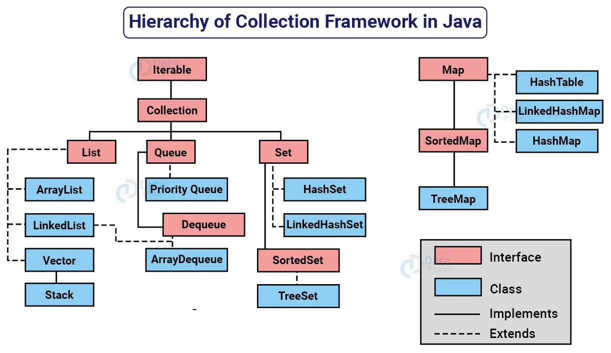

# Collection Framework API
## 🚀 Descrição
- Uma coleção (collection) é uma estrutura de dados que serve para agrupar muitos elementos em uma única unidade, estes elementos precisão ser Objetos.
- Uma Collection pode ter coleções homogêneas e heterogêneas, normalmente utilizamos coleções homogêneas de um tipo especifico.
- O núcleo principal das coleções é formado pelas interfaces da figura a abaixo, essas interfaces permitem manipular a coleção independente do nível de detalhe que elas representam.
- Temos quatro grandes tipos de coleções: List (lista), Set (conjunto), Queue (fila) e Map (mapa), a partir dessas interfaces, temos muitas subclasses concretas que implementam varias formas diferentes de se trabalhar com cada coleção.

Este repositório tem como objetivo praticar os conceitos de collections, realizado mas aulas da professora Camila da DIO.